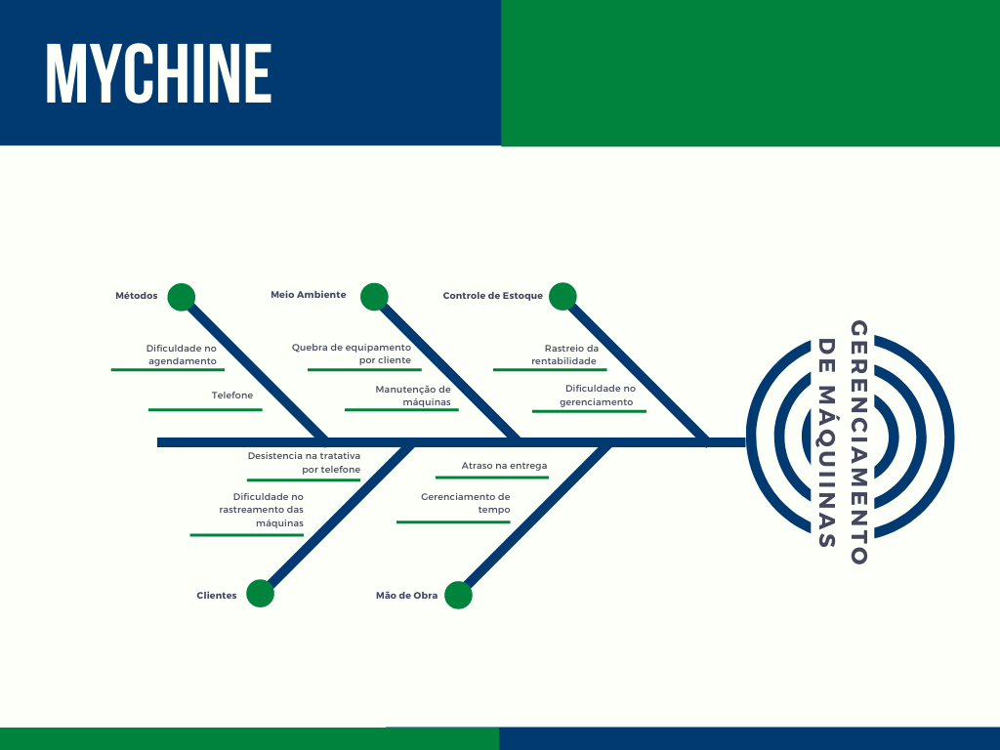

# Diagrama de Causa e Efeito

## Versionamento

|Versão | Data | Comentários | Autor(es) |
|-------|------|-------------|-----------|
|0.1|27/07/2021| Abertura do documento 5W2H| Giovanna B Bottino|
|0.2|27/07/2021| Adiciona diagrama de ishikawa | Giovanna B Bottino e Kess Jhones Gomes Tavares|

## Diagrama de Ishikawa
O Diagrama de Causa e Efeito ou Diagrama de Ishikawa é um gráfico utilizado para analisar problemas. Conforme o diagrama, esses problemas podem ser classificados em 6 tipos: 

- Máquina
- Materiais
- Mão de obra
- Meio ambiente
- Medida
- Método

Nossa equipe decidiu utilizar esse diagrama, porque ele é de fácil entendimento e permite uma análise maior sobre o problema. Importante lembrar que nem sempre é utilizado todos os M's.

## Diagrama de Ishikawa - Mychine V1

## Referências

Diagrama de Ishikawa (Ferramenta da Qualidade): Teoria + Exemplo Prático. Disponível em: https://www.youtube.com/watch?v=U-0qzmFqH-0&ab_channel=AprendendoGest%C3%A3o. Acesso em: 27 de julho de 2021.

SERRANO, Milene. 5W2H, 2021. Material apresentado na Disciplina de Arquitetura e Desenho de Software do curso de engenharia de software da UnB, FGA. Acesso em: 27 de julho de 2021.

